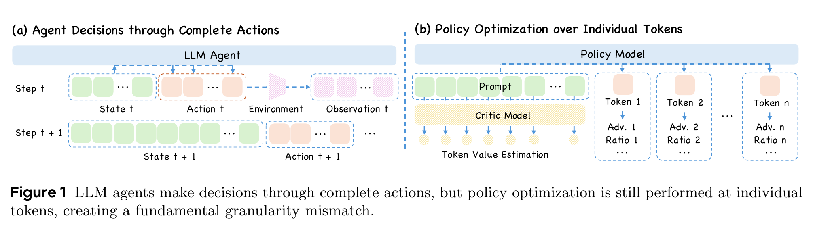
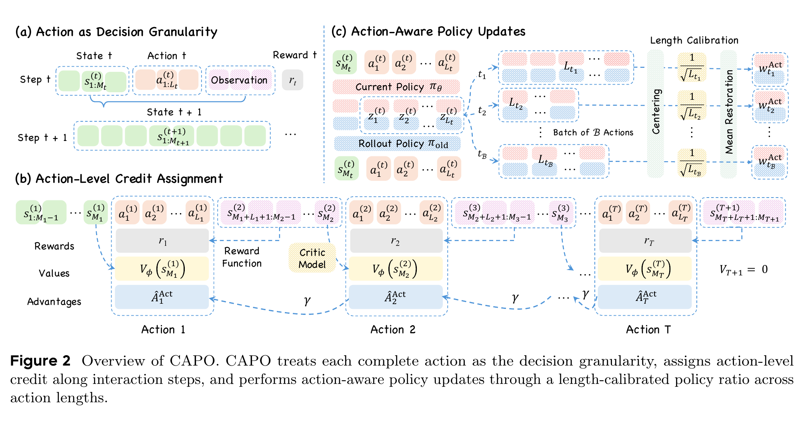
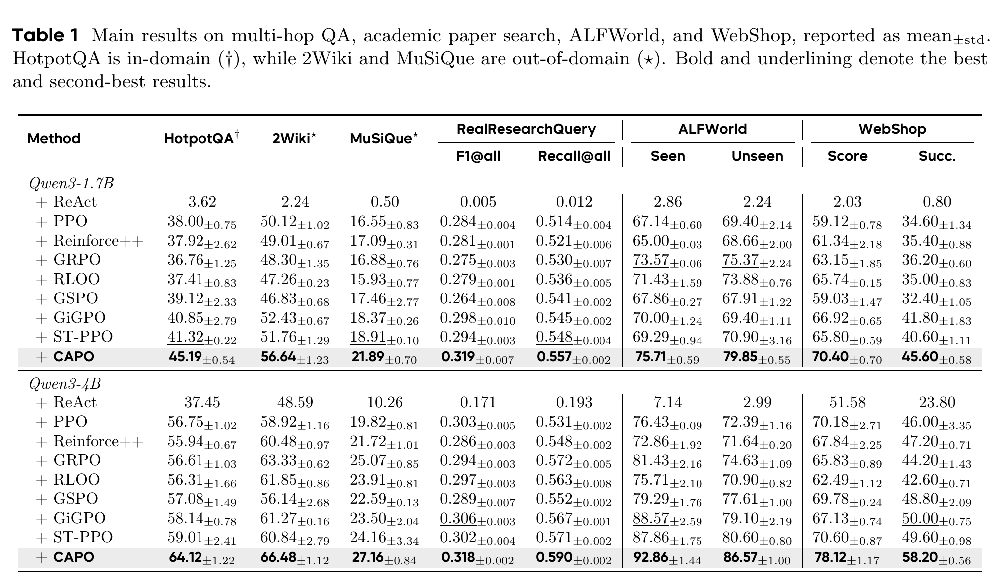
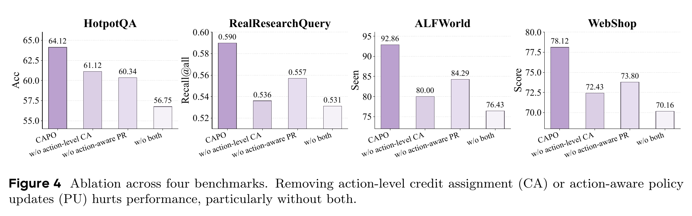
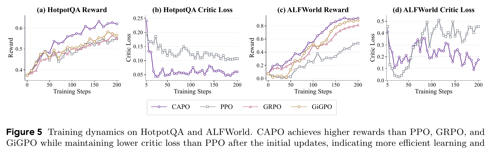

# CAPO: Critic-Guided Action-Aligned Policy Optimization

CAPO is a critic-guided reinforcement learning approach for improving the multi-turn capabilities of LLM agents. Its central premise is simple: agents make decisions through **complete actions**—for example, a response containing reasoning and a tool call—while conventional policy optimization commonly assigns credit and applies updates token by token. CAPO aligns these operations with the action, the unit at which the environment actually changes.

> **Action-aligned policy optimization:** estimate credit at action boundaries and update whole actions consistently, while retaining token-level gradient computation.

## The granularity mismatch

In an agent trajectory, an LLM observes a state, generates a complete action, receives an environment response, and then moves to the next state. Tokens are the mechanism used to generate that action; they are not independently executed decisions.

Token-level optimization can therefore create a mismatch between how agents act and how they are trained. It may assign separate values, advantages, ratios, and clipping decisions to tokens that together form one environmental action. On the other hand, trajectory-level methods can be too coarse: one shared signal cannot distinguish helpful intermediate actions from unhelpful ones in a long interaction.

*Figure 1 from the CAPO paper. The agent acts through complete actions, but conventional optimization often remains token-wise.*

## CAPO at a glance

CAPO treats each complete agent response as the decision granularity. It combines two complementary designs:

1. **Action-level credit assignment.** A critic estimates the value of the state immediately before an action. The resulting advantage evaluates the contribution of that entire action and is propagated across interaction steps, enabling distinct credit for intermediate decisions.
2. **Action-aware policy updates.** CAPO aggregates token-level policy changes into an action-level ratio. It calibrates this ratio for action length, so that actions of different lengths receive comparable weighting and clipping rather than letting length alone distort the update.

*Figure 2 from the CAPO paper. CAPO aligns decision granularity, credit assignment, and policy updates around complete actions.*

## Why action alignment matters

The critic provides a state-aware signal at the point where an agent commits to an action. This lets CAPO distinguish decisions within the same trajectory, including when reward is delayed until the end of an episode. The action-aware ratio then makes the policy update follow the same unit of credit: the complete action.

These two pieces solve different parts of the problem. Credit assignment determines **which decision** should be reinforced or discouraged; policy updating determines **how strongly and consistently** that decision changes the policy. CAPO jointly aligns both with the agent's interaction loop.

## Empirical picture

The paper evaluates CAPO on multi-hop question answering, academic paper search, and text-based action tasks. Across HotpotQA, RealResearchQuery, ALFWorld, and WebShop, CAPO outperforms the compared reinforcement learning baselines under the reported evaluation protocols.

*Table 1 from the CAPO paper. Main results across multi-hop QA, academic paper search, ALFWorld, and WebShop.*

The ablations show that both action-level credit assignment and action-aware policy updates contribute: removing either weakens performance, and removing both is particularly harmful.

*Figure 4 from the CAPO paper. Both action-level credit assignment and action-aware policy updates are important across four agent benchmarks.*

Training dynamics further show stronger rewards for CAPO on HotpotQA and ALFWorld. The reported critic-loss curves indicate more controlled critic behavior than PPO after the initial updates.

*Figure 5 from the CAPO paper. CAPO's training dynamics compared with PPO, GRPO, and GiGPO.*

## Contributions

- Reframes multi-turn LLM-agent optimization around the complete action, the unit that drives an environment transition.
- Uses a critic to provide action-specific credit across long-horizon interactions.
- Introduces length-calibrated, action-aware policy updates so variable-length actions are treated consistently.
- Demonstrates consistent gains across question answering, paper search, and text-world agent tasks.
